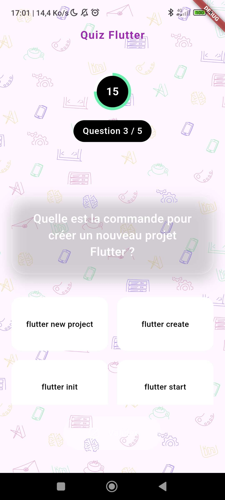
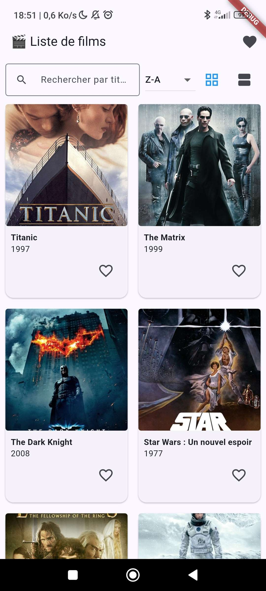
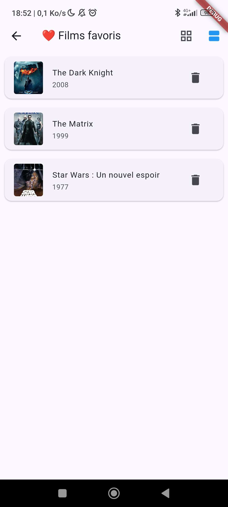

*Dépot des TP flutters*

# TP1 – Carte de profil interactive
## 🎯 Objectifs
Découvrir la structure d'un projet Flutter
Manipuler les widgets de base (Column, Row, Stack, Image, Text, Icon)
Styliser son interface avec des gradients et des ombres
Gérer les interactions (ouvrir un lien, partager une info)
Créer des widgets personnalisés réutilisables

Développement d'une page base, prise en main des widgets élémentaires, réalisation des 8 étapes attendus et l'ajout d'un bouton like avec un état bool et des ScaffoldMessenger.

# TP2 – Quiz interactif avec score
## 🎯 Objectifs
Découvrir la gestion de l’état avec setState()
Manipuler des listes et des modèles de données simples
Créer une interface de quiz à choix multiples
Calculer et afficher un score final

Réalisation d'un quizz dynamique avec les 3 étapes attendus compléter ainsi que le bonus Timer

# TP3 – Liste de films avec favoris (JSON local)

### 🎯 Objectifs
Charger et afficher des données dynamiques depuis un JSON local
Utiliser des widgets de liste (ListView, ListTile, GridView)
Gérer des favoris localement
Structurer son code en plusieurs fichiers
Découvrir les tests unitaires en Flutter

Développement d'une filmographie, avec les 6 étapes ainsi que les trois bonus: barre de recherche et outil de trie ; affichage en grid/liste ; test unitaire