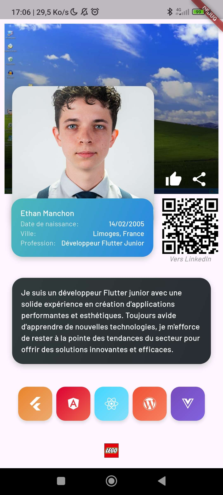

# TP1 – Carte de profil interactive

## 🎯 Objectifs
Découvrir la structure d'un projet Flutter
Manipuler les widgets de base (Column, Row, Stack, Image, Text, Icon)
Styliser son interface avec des gradients et des ombres
Gérer les interactions (ouvrir un lien, partager une info)
Créer des widgets personnalisés réutilisables

Développement d'une page base, prise en main des widgets élémentaires, réalisation des 8 étapes attendus et l'ajout d'un bouton like avec un état bool et des ScaffoldMessenger.
