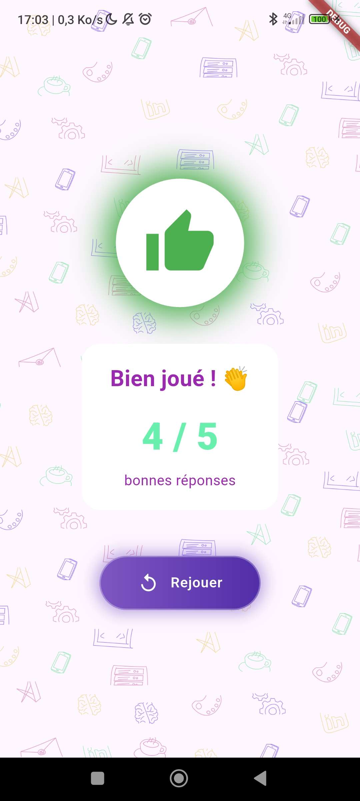

# TP2 – Quiz interactif avec score

## 🎯 Objectifs
Découvrir la gestion de l’état avec setState()
Manipuler des listes et des modèles de données simples
Créer une interface de quiz à choix multiples
Calculer et afficher un score final

Réalisation d'un quizz dynamique avec les 3 étapes attendus compléter ainsi que le bonus Timer

