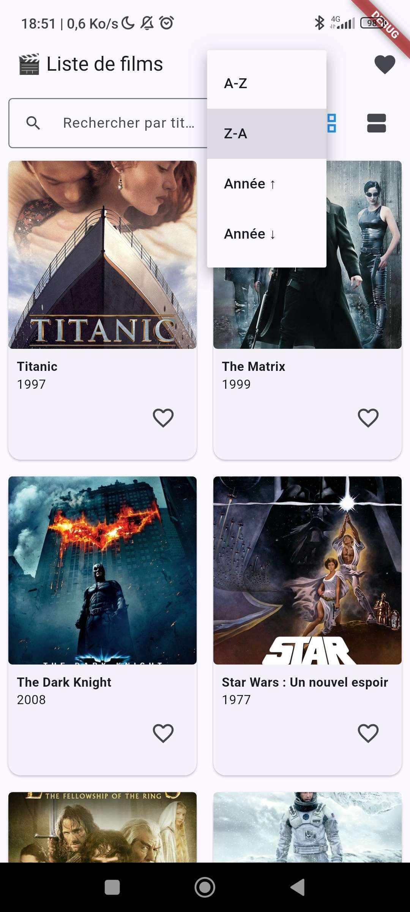

# TP3 – Liste de films avec favoris (JSON local)

### 🎯 Objectifs
Charger et afficher des données dynamiques depuis un JSON local
Utiliser des widgets de liste (ListView, ListTile, GridView)
Gérer des favoris localement
Structurer son code en plusieurs fichiers
Découvrir les tests unitaires en Flutter

Développement d'un site filmographique, avec les 6 étapes ainsi que les trois bonus: barre de recherche et outil de trie ; affichage en grid/liste ; test unitaire